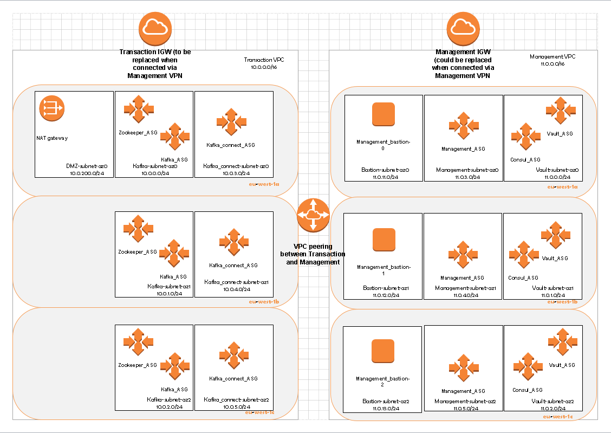
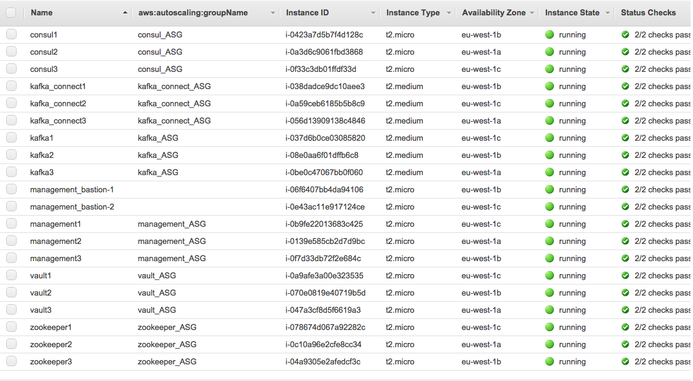

# Kafka Zookeeper with Vault

## Accelerator for running Kafka, Zookeeper, and Vault in AWS 
### About the Accelerator
- Packer files for the Bastion hosts, Management tools, Kafka, Zookeeper, and Vault servers
- Terraform files the Bastion hosts, Management tools, Kafka, Zookeeper, and Vault servers/ASG's
- Python scripts to start the applications on the servers
- The design has two VPC's:

&nbsp;&nbsp; Transaction - where the main app resides that uses Kafka/zookeeper

&nbsp;&nbsp; Management - where the bastions, Management tools, and Vault reside

- within these VPC's are separate subnets to allow the components to be divided across AZ's
via the ASG's. You can vary the size of the ASG's: 

&nbsp;&nbsp; -The zookeeper ASG has 3 intances (it's recommended to start with 3 to give full resiliance and no more than 5) 

&nbsp;&nbsp; -The Kafka ASG has 5

&nbsp;&nbsp; -The Kafka Connect ASG has 3

&nbsp;&nbsp; -The Vault ASG has 1

&nbsp;&nbsp; -The Management ASG has 3

- The Kafka Connect nodes have been set up in distributed mode, but has no connectors defined

- VPC peering allows traffic between the two

- The ASG intances get allocated valid Name tags (and DNS names) via instance tracking 
DynamoDB tables. DynamoDB tables were used instead of s3 objects because of issues with 
latency and race conditions. Often instances would get the same names on environment 
creation. If you wish to use S3, there is commented code both in the Packer and Terraform files that 
show you how to do this.

- The Management instances have two pre-installed kafka and zookeeper management tools 
installed via docker images: 
    - Kafka Manager (port 9000 - https://github.com/yahoo/kafka-manager)
    - Zoonavigator (port 8001 - https://github.com/elkozmon/zoonavigator)

### Pre-Reqs
- Terraform installed
- Packer installed
- AWS CLI installed

### Getting Started Instructions
#### update the packer .json files
- In bastion_base.json:

    - replace these variable values with your org's own:
        - "access_key": "&lt;Access key for user allowed to assume role defined in Terraform&gt;",
          "secret_key": "&lt;Secret key for user allowed to assume role defined in Terraform&gt;",
          "account_id": "&lt;your account ID&gt;"
    - replace these values in the following lines:
        - "echo \"[paul]\naws_access_key_id=**&lt;Access key for user allowed to assume role defined in Terraform&gt;**\naws_secret_access_key=**&lt;Secret key for user allowed to assume role defined in Terraform&gt;**\n\n[default]\naws_access_key_id=**&lt;Access key for user allowed to assume role defined in Terraform&gt;**\naws_secret_access_key=**&lt;secret key for user allowed to assume role defined in Terraform&gt;**\" | sudo tee --append ~/.aws/credentials"
        - "echo \"[default]\nregion=eu-west-1\n\n[profile terraform]\nrole_arn=**&lt;ARN for role defined in Terraform&gt;**\nsource_profile=paul\nregion=eu-west-1\" | sudo tee --append ~/.aws/config"

- In zookeeper.json:

    - replace these values in the following lines:
        - "echo \"[paul]\naws_access_key_id=**&lt;Access key for user allowed to assume role defined in Terraform&gt;**\naws_secret_access_key=**&lt;Secret key for user allowed to assume role defined in Terraform&gt;**\n\n[default]\naws_access_key_id=**&lt;Access key for user allowed to assume role defined in Terraform&gt;**\naws_secret_access_key=**&lt;secret key for user allowed to assume role defined in Terraform&gt;**\" | sudo tee --append ~/.aws/credentials"
        - "echo \"[default]\nregion=eu-west-1\n\n[profile terraform]\nrole_arn=**&lt;ARN for role defined in Terraform&gt;**\nsource_profile=paul\nregion=eu-west-1\" | sudo tee --append ~/.aws/config"

- In vault-consul.json:

    - replace these values in the following lines:
        - "echo \"[paul]\naws_access_key_id=**&lt;Access key for user allowed to assume role defined in Terraform&gt;**\naws_secret_access_key=**&lt;Secret key for user allowed to assume role defined in Terraform&gt;**\n\n[default]\naws_access_key_id=**&lt;Access key for user allowed to assume role defined in Terraform&gt;**\naws_secret_access_key=**&lt;secret key for user allowed to assume role defined in Terraform&gt;**\" | sudo tee --append ~/.aws/credentials"
        - "echo \"[default]\nregion=eu-west-1\n\n[profile terraform]\nrole_arn=**&lt;ARN for role defined in Terraform&gt;**\nsource_profile=paul\nregion=eu-west-1\" | sudo tee --append ~/.aws/config"

- In management-tools.json:

    - replace these values in the following lines:
        - "echo \"[paul]\naws_access_key_id=**&lt;Access key for user allowed to assume role defined in Terraform&gt;**\naws_secret_access_key=**&lt;Secret key for user allowed to assume role defined in Terraform&gt;**\n\n[default]\naws_access_key_id=**&lt;Access key for user allowed to assume role defined in Terraform&gt;**\naws_secret_access_key=**&lt;secret key for user allowed to assume role defined in Terraform&gt;**\" | sudo tee --append ~/.aws/credentials"
        - "echo \"[default]\nregion=eu-west-1\n\n[profile terraform]\nrole_arn=**&lt;ARN for role defined in Terraform&gt;**\nsource_profile=paul\nregion=eu-west-1\" | sudo tee --append ~/.aws/config"

- In kafka.json:

    - replace these values in the following lines:
        - "echo \"[paul]\naws_access_key_id=**&lt;Access key for user allowed to assume role defined in Terraform&gt;**\naws_secret_access_key=**&lt;Secret key for user allowed to assume role defined in Terraform&gt;**\n\n[default]\naws_access_key_id=**&lt;Access key for user allowed to assume role defined in Terraform&gt;**\naws_secret_access_key=**&lt;secret key for user allowed to assume role defined in Terraform&gt;**\" | sudo tee --append ~/.aws/credentials"
        - "echo \"[default]\nregion=eu-west-1\n\n[profile terraform]\nrole_arn=**&lt;ARN for role defined in Terraform&gt;**\nsource_profile=paul\nregion=eu-west-1\" | sudo tee --append ~/.aws/config"

#### In the /Packer/?/install-?/ dirs (? = server name)
- add the .pem file for the user allowed to assume the role **system_role** defined by Terraform
- replace this value in:
    - private_key = paramiko.RSAKey.from_private_key_file('/tmp/install-kafka/**&lt;your .pem file>&gt;**')
- **For Vault ONLY** replace these variable values with your org's own, in the /Packer/Vault/run-vault/run-vault script:
    - access_key = "&lt;Access key for user allowed to assume role defined in Terraform&gt;"
    secret_key = "&lt;Secret key for user allowed to assume role defined in Terraform&gt;"

#### update the terraform .tf files
- In /Terraform/envs/test/main.tf
    - "Principal": {
          "AWS": "arn:aws:iam::**&lt;your account ID&gt;**:root"
        } in definiing the system_role IAM role
- In /Terraform/envs/test/variables.tf
    - variable "terraform_role" {
    default = "**&lt;ARN for IAM Role predefined to allow Terraform to create everything&gt;**"
    description = "The AWS urole that terraform would use"
  }
- In the /Terraform/modules/?_ASG directories
    - in the data "aws_ami" ?_node { definition, replace: owners = ["**&lt;your account ID&gt;**"] with the same account number defined in the packer files
    
#### Create the AMI's needed with Packer
- In the Packer directories containing the respctive .json files:
    - packer build vault-consul.json
    - packer build management-tools.json
    - packer build kafka.json
    - packer build zookeeper.json

### Using the Environment
- In /Terraform/envs/test:
    - init Terraform:  **terraform init -var-file=&lt;directory of your credential file&gt;/credentials.tvars**
    - get the modules: **terraform get**
    - run the plan:  **terraform plan -var-file=&lt;directory of your credential file>&gt;/credentials.tvars -out=./plan**
    - create the environment: **terraform apply ./plan**
- when fully run, your AWS instances will look like:

### to-Do's
- create Vault and consul clusters
- Vault requires harcoded AWS keys in run-vault, this needs fixing
- create an initalisation script to update the user, role, and key info
- define a network ACL to restric traffic between VPC's
- add LB's for better ASG health checking

### License
Copyright [2017] [Paul Pogonoski]

Licensed under the Apache License, Version 2.0 (the "License");
you may not use this file except in compliance with the License.
You may obtain a copy of the License at

    http://www.apache.org/licenses/LICENSE-2.0

Unless required by applicable law or agreed to in writing, software
distributed under the License is distributed on an "AS IS" BASIS,
WITHOUT WARRANTIES OR CONDITIONS OF ANY KIND, either express or implied.
See the License for the specific language governing permissions and
limitations under the License.
